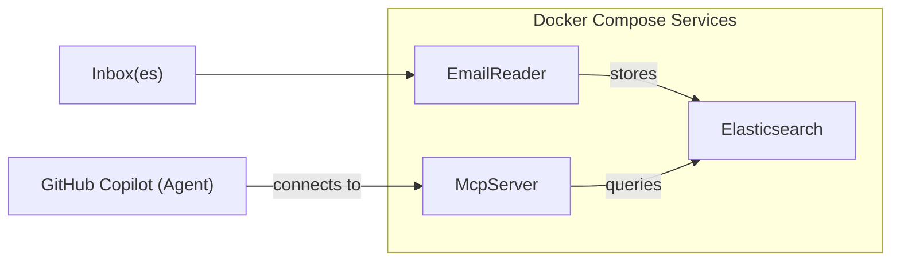

# Email Reader and MCP Server

This repository contains two main projects: an Email Reader service and a Model Context Protocol (MCP) server for knowledge base integration. When run with `docker-compose`, these services will retrieve emails from your inbox of choice (using IMAP) and will store them in Elasticsearch for querying by the McpServer.

## Technologies Used

- .NET 9 (C#)
- Elasticsearch 9.0.3 (for storing and searching email content)
- MailKit (for retrieving emails via IMAP)
- Model Context Protocol (MCP) for server-client integration (tested with GitHub Copilot)
- xUnit (for unit testing)

## Architecture



## How to Run

### Prerequisites

- .NET 9 SDK
- Docker and Docker Compose

### Docker Compose

To run the solution locally, use Docker Compose. This will start both the MCP server and an Elasticsearch instance:

```bash
docker-compose up
```

### Add Local MCP Server to VS Code for GitHub Copilot

To add the local MCP server to VS Code, create the file `.vscode/mcp.json` in your workspace or user settings:

```json
{
    "servers": {
        "knowledgebase-search-emails": {
            "url": "http://localhost:5000/api/mcp"
        }
    }
}
```

### Run Email Reader

To run the Email Reader service, either modify `EmailReader/appsettings.json` or set the required environment variables:

```bash
export Imap__Host="your-imap-host"
export Imap__Port="993"
export Imap__UseSsl="true"
export Imap__Username="your-imap-username"
export Imap__Password="your-imap-password"
export Imap__Folders__0="INBOX"
export Imap__Folders__1="Sent"
export Elasticsearch__Url="http://localhost:9200"
```

Then run the service:

```bash
dotnet run --project EmailReader/EmailReader.csproj
```

## Project Structure

### EmailReader
- Reads emails from an IMAP server and indexes them into Elasticsearch
- Supports nested folder structures (e.g., "INBOX/Subfolder")
- Creates Elasticsearch index templates for optimal search performance
- Extracts email metadata: subject, body, from/to/cc/bcc addresses, attachments, and date

### McpServer
- Implements the Model Context Protocol (MCP) server
- Provides email search functionality through Elasticsearch
- Exposes search tools for GitHub Copilot integration
- Supports multi-match queries across email subject and body fields

### EmailReader.Tests and McpServer.Tests
Unit tests

## Configuration

### Email Reader Configuration

The EmailReader service requires the following configuration:

- `Imap:Host` - IMAP server hostname
- `Imap:Port` - IMAP server port (default: 993)
- `Imap:UseSsl` - Use SSL/TLS (default: true)
- `Imap:Username` - IMAP username
- `Imap:Password` - IMAP password
- `Imap:Folders` - Array of folder paths to process
- `Elasticsearch:Url` - Elasticsearch server URL

### MCP Server Configuration

The MCP server requires:

- `Elasticsearch:Url` - Elasticsearch server URL
- `Elasticsearch:DefaultIndex` - Default index for email searches

These configuration settings are set to the correct values when running with `docker-compose`.